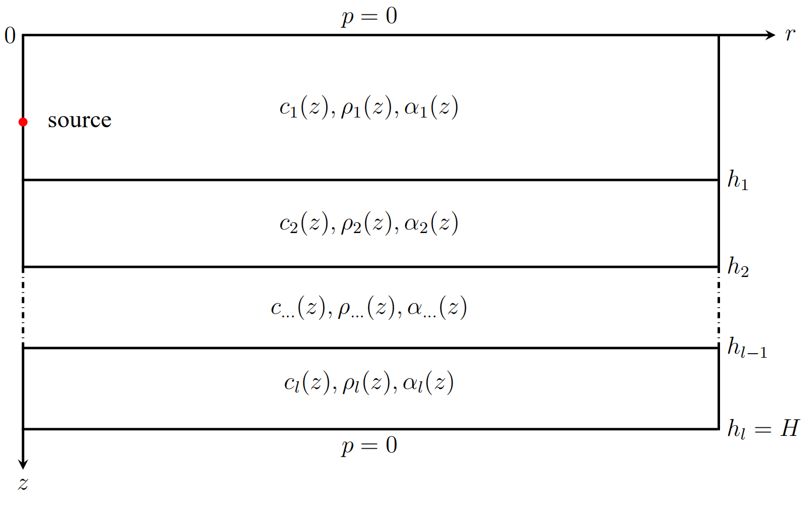

# MultiLC
Applying the Legendre/Chebyshev collocation methods based on domain decomposition for calculating underwater sound propagation in a horizontally stratified environment

**`MultiLC/MultiCC_readme`, Jul. 22, 2021, Houwang Tu, National University of Deffense Technology**

The programs `MultiLC.m` and `MultiCC.m` computes the range-independent modal acoustic field in
Fig.1 using the Legendre and Chebyshev collocation method, respectively. The Legendre 
collocation method is described in the article (H. Tu, Y. Wang, Q. Lan et al., Applying a Legendre 
collocation method based on domain decomposition to calculate underwater sound propagation in a 
horizontally stratified environment, https://doi.org/10.1016/j.jsv.2021.116364). Both of the programs
use the same input file "`input.txt`", '`ReadEnvParameter`' function/subroutine is used
to read "`input.txt`" file. User can make changes to "`input.txt`" for the desired calculation. 

It is worth mentioning that the Fortran version of the `MultiLC.m` calls the subroutines '`zgeev()`' 
and '`zgesv()`' in the Lapack (a numerical library) to solve the eigenvalues of the complex matrix, 
so the user needs to install the Lapack on the computer when running `MultiLC.f90`, and
may need to make simple modifications to the Makefile. Both the Matlab
and Fortran versions of `MultiLC.m` will eventually generate the same
format of the binary sound field file "`tl.bin`", and the
`plot_binary_tl.m` program can be used to read the sound field binary
data and plot.

The "`input.txt`" file contains the parameters defining the modal
calculation. See the following example:

```
Example1                          ! casename
2                                 ! Ns (number of layers)
50                                ! N1 (truncation order of water column)
50                                ! N2 (truncation order of bottom sediment)
3000.0                            ! cpmax (maximum phase speed limit)
20.0                              ! freq (frequency of source)
36.0                              ! zs (depth of source)
36.0                              ! zr (depth of special receiver)
3000.0                            ! rmax (receiver ranges(m))
3                                 ! dr (discrete step in horizontal direction)
50.0                              ! h1 (thickness of water column)
100.0                             ! h2 (thickness of ocean)
0.1                               ! dz (discrete step in depth direction)
40                                ! tlmin (minimum value of TL in colorbar)
70                                ! tlmax (maximum value of TL in colorbar)
2                                 ! n1 (profiles' points in water column)
2                                 ! n2 (profiles' points in bottom sediment)
    0.0 1500.0  1.0   0.0         ! dep1 c1 rho1 alpha1
   50.0 1500.0  1.0   0.0
   50.0 1800.0  1.5   1.5         ! dep2 c2 rho2 alpha2
  100.0 1800.0  1.5   1.5

```

The "`input.txt`" file include:

* `casename` is the name of current example,

* `Ns` is the number of layers,

* `N1` (the number to truncated order of 1st layer), 

* `N2` (the number to truncated order of 2nd layer). 

  `N1` and `N2` may be equal or unequal. Generally speaking, the
  more complicated the shape of the sound speed profile, the more `N1` and
  `N2` are needed to accurately fit.

* `cpmax` is the maximum phase speed limit, which used to determine how many
  modes are accumulated in the final synthesized sound field, generally
  set by the user according to experience (m/s). 

* `freq` (frequency of sound source, Hz), 

* `zs` (the depth of source, m), 

* `zr` (depth of a special receiver, user used to specify to draw the transmission loss curve of
  arbitrary depth, m), 

* `rmax` (the maximum range of horizontal direction,
  m), 

* `dr` (horizontal discrete step, m),

* `h1` (thickness of 1st layer, m),

* `h2` (thickness of ocean, m), `h1` must less than `h2`, 

* `dz` (discrete step size in depth direction, m),

* `tlmin`
  and `tlmax` are the minmum and maximum value transmission loss,
  respectively, which used to determine the color range of the output
  transmission loss graph, `tlmin` must less than `tlmax`.

* `n1` and `n2` are the amount of environmental profile data in the two layers. 

  There are Ns tables of environmental parameter, the units are depth(m), speed(m/s),
  density(g/cm$^3$) and attenuation (dB/wavelength), with `n1` and `n2`
  points in each. It is necessary that `dep1(n1)=dep2(1)` where the
  density usually has a discontinuity. The first entry `dep1(1)=0` is the
  free surface. The last entry `dep2(n2)=H` determines the total thickness
  of the waveguide. 

  

  Figure 1. Horizontally stratified environment.
